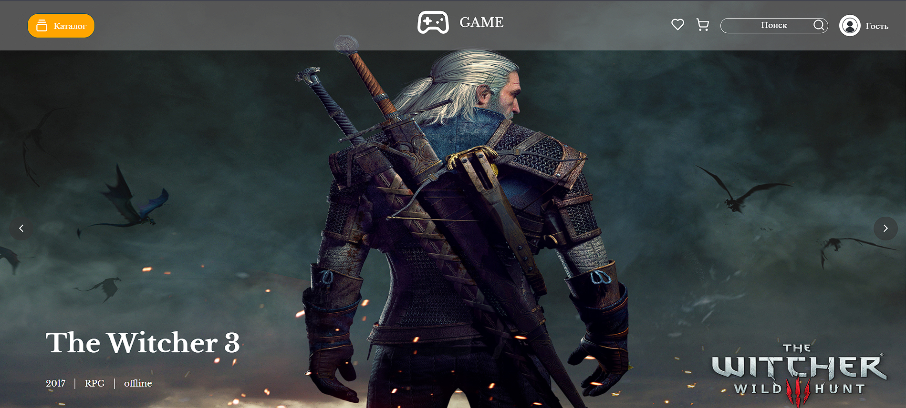
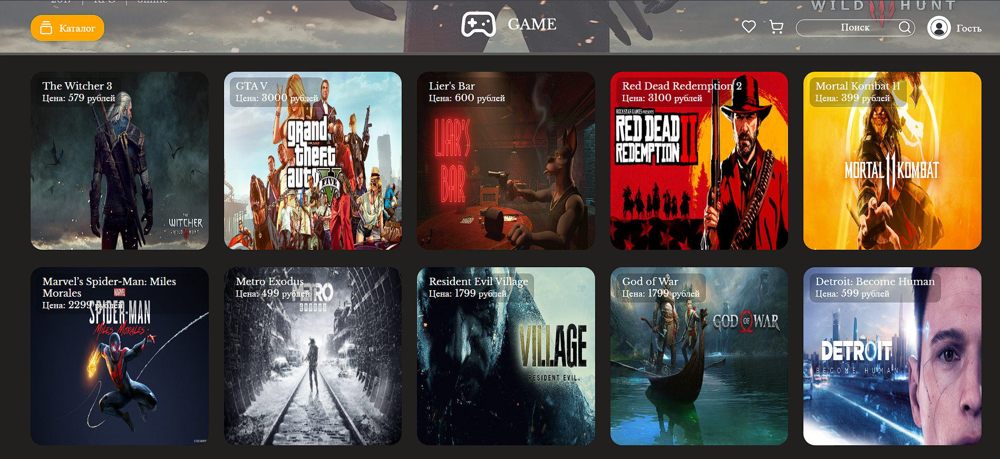

# RG Store

Магазин продажи ключей для игр на ПК, Playstation и Xbox c корзиной, страницей описания игры, страницей избранного

- [Посмотреть проект на стенде](https://game-shop-sandy.vercel.app/)  
- [Ссылка на GitHub](https://github.com/UstinskiyDmitriy/game-store)

### Технологии
- React
- CSS
- Redux Toolkit
- React Router
- Local Storage 
- Git

### Что было сделано

- Вёрстка компонентов на React 
- Основная страница с каталогом и каруселью 
- Страница описания товара 
- Страница с избранным 
- Страница корзины
- Реализован поиск товаров
- Регистрация пользователя с сохранением в localStorage
- Валидация формы регистрации и входа 
- Роутинг с использование react router
- Настроен Redux Toolkit 

### Планы по доработке и рефакторингу

- Перенести данные карточек товаров и пользователей в базу данных
- Реализовать регистрацию пользователей с использованием бэкэнда
- Реализовать форму оплаты 
- Реализовать отправку тестового ключа игры на почту пользователя при покупке  
- Добавить форму поплнения баланса 
- Создать страницу профиля пользователя 

### Инструкция по запуску 

Для запуска проектра необходимо: 

1. Склонируйте этот репозиторий: https://github.com/UstinskiyDmitriy/game-store.git
2. Установите зависимости: __npm install__
3. Запустите проект: __npm run dev__

